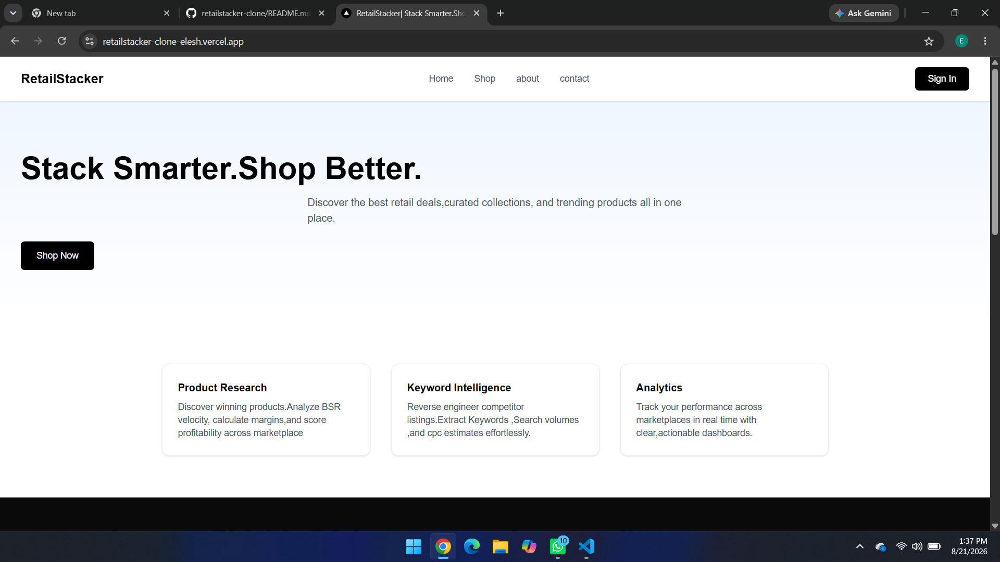
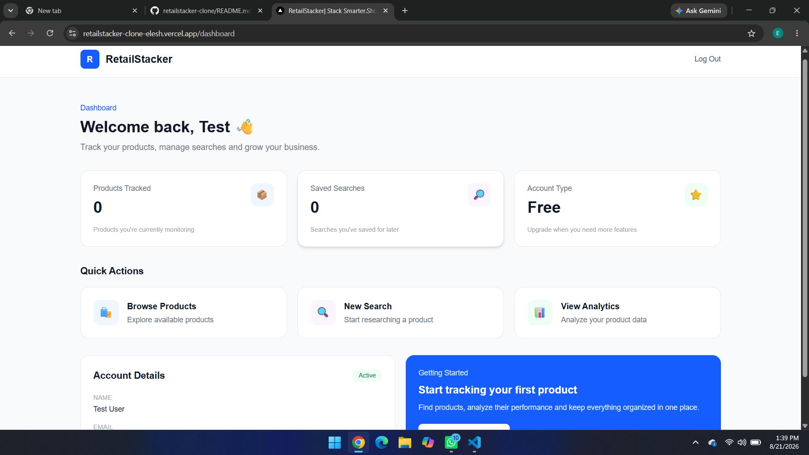
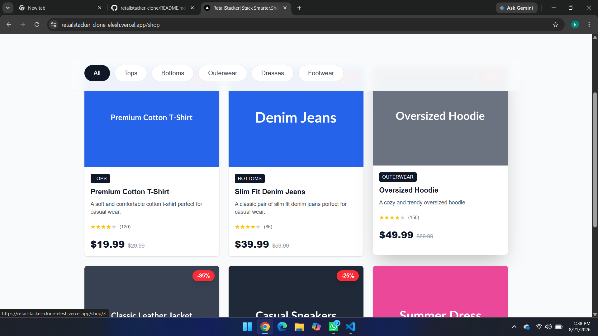

# 🏪 Retailstacker - E-commerce Platform

Stack Smarter. Shop Better.

## 🌐 Live Demo
**[View Live Site](https://YOUR-VERCEL-URL.vercel.app)**

## 📸 Screenshots





## ✨ Features

- 🛍️ **Product Research** - Discover winning products and analyze BSR velocity
- 🔍 **Keyword Intelligence** - Reverse engineer competitor listings
- 📊 **Analytics** - Track performance across marketplaces in real-time
- 📱 **Fully Responsive** - Works on all devices

## 🛠️ Tech Stack

- **Framework:** Next.js 15
- **Language:** TypeScript
- **Styling:** Tailwind CSS
- **Deployment:** Vercel

## 📦 Installation

```bash
# Clone the repository
git clone https://github.com/eleshkala0-netizen/retailstacker-clone.git

# Install dependencies
cd retailstacker-clone
npm install

# Run development server
npm run dev